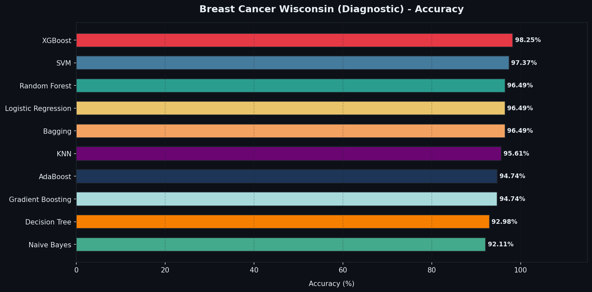
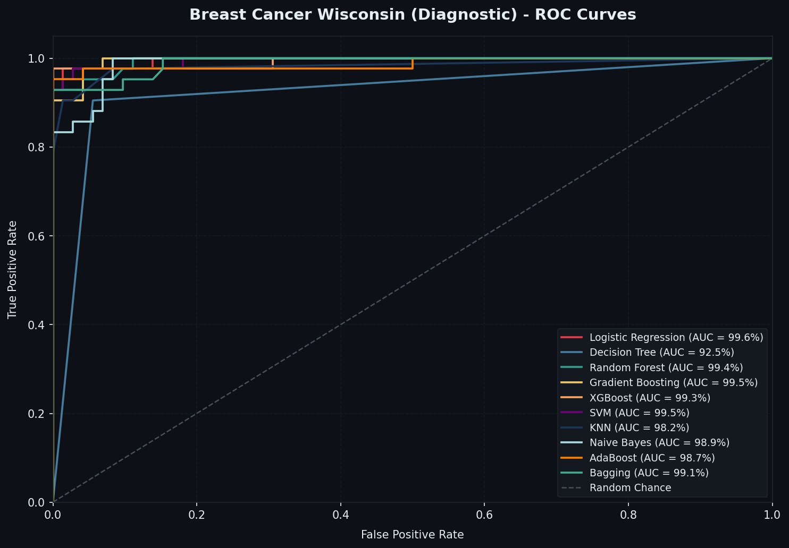
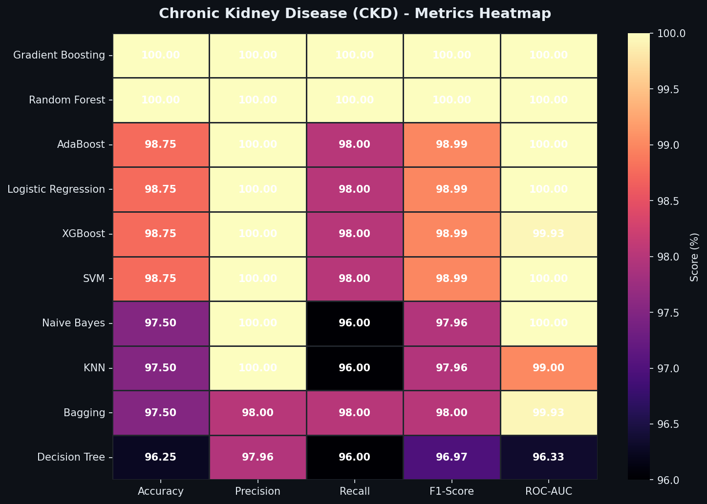
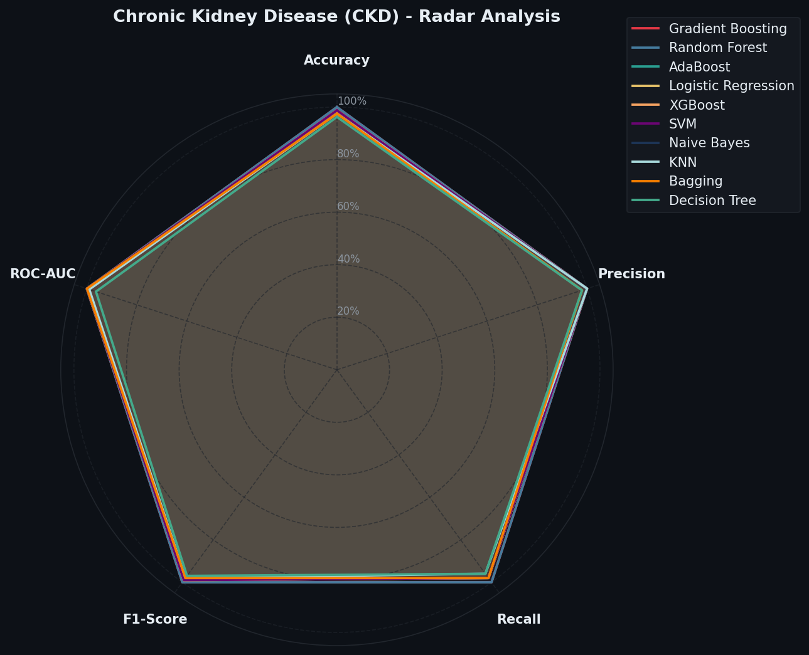
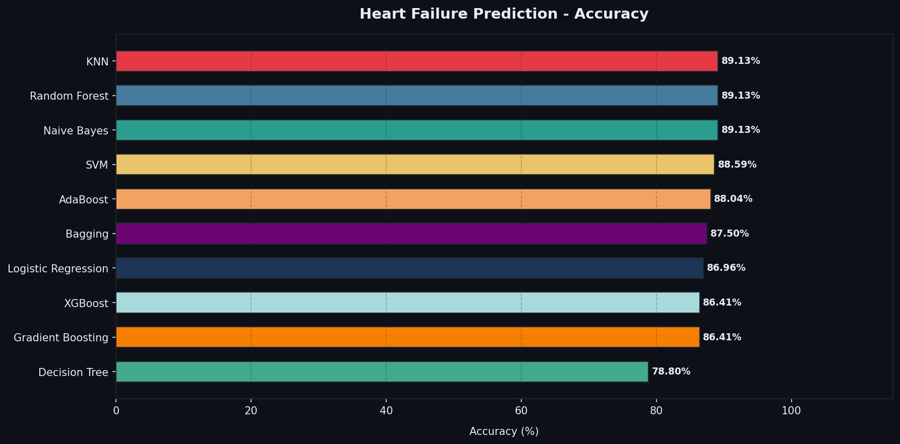
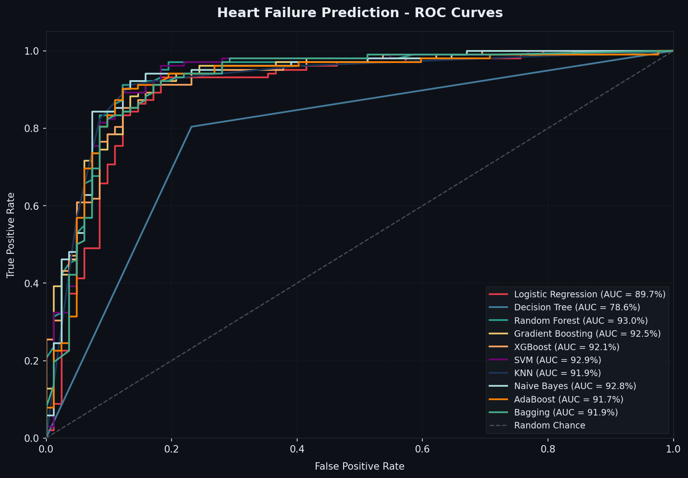
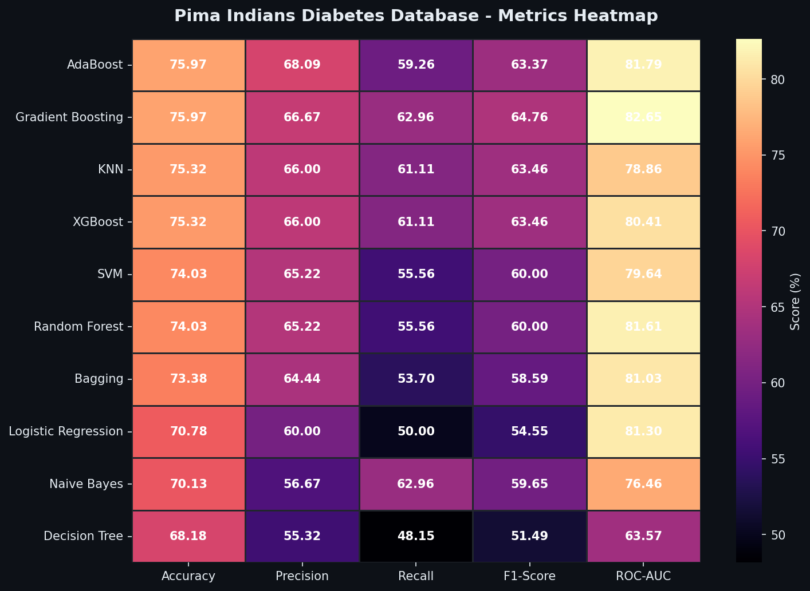
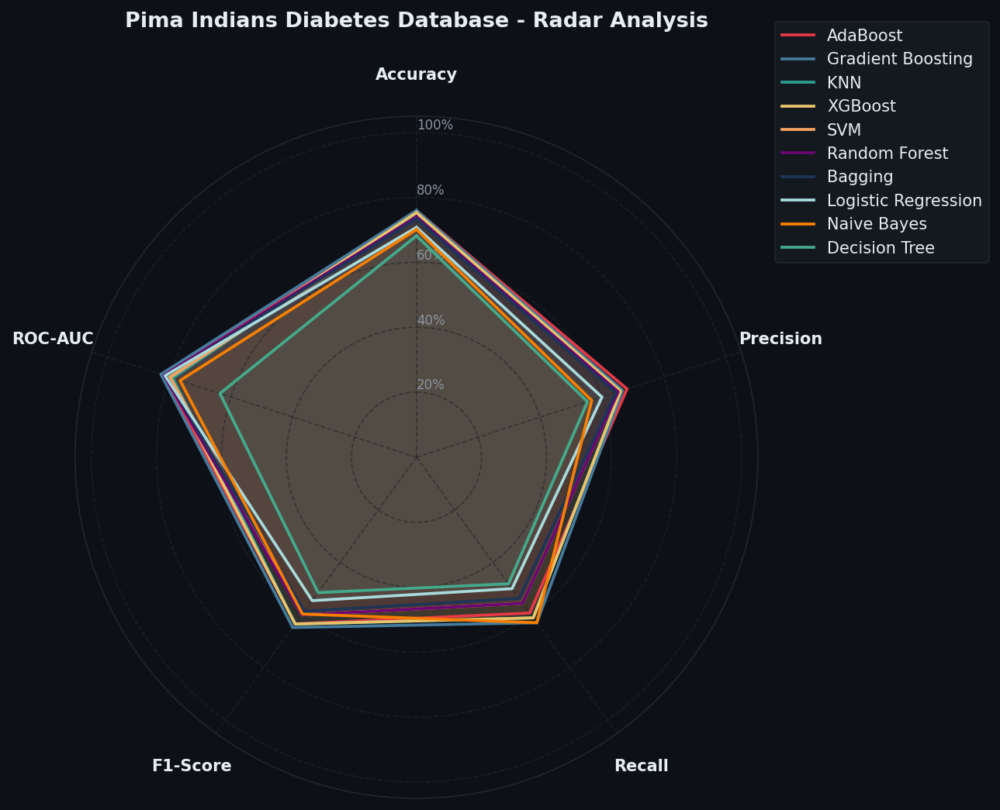
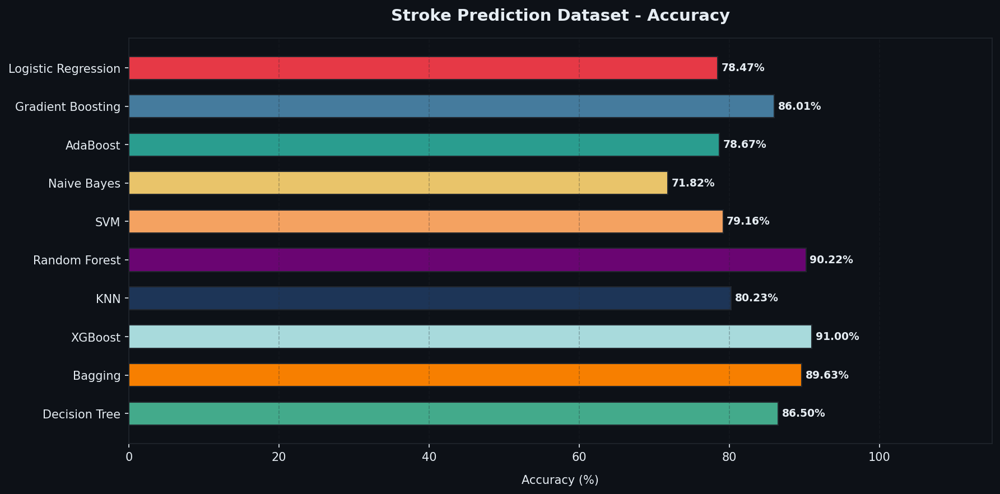
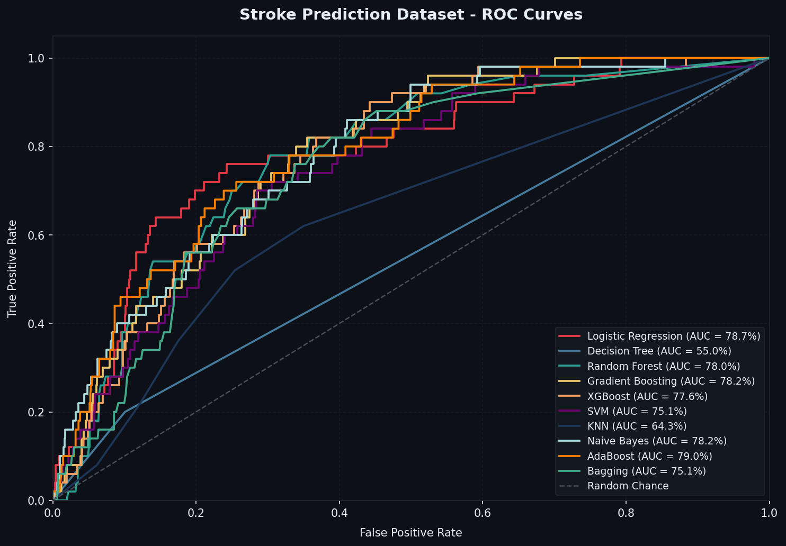

# 🏥 Comparative Analysis of Machine Learning Models for Healthcare Diagnostics

[](https://github.com/Yasir-Alazmi/Comparative-Analysis-of-Machine-Learning-Models-for-Healthcare-Diagnostics/actions)
[](https://www.kaggle.com/code/yasirnalazmi/clinical-ai-benchmark-10-diagnostic-ml-models)
[](https://python.org)
[](https://scikit-learn.org)
[](https://xgboost.readthedocs.io)
[](LICENSE)

An exhaustive, standardized benchmarking study comparing **10 foundational machine learning algorithms** across **5 real-world clinical disease datasets** from Kaggle. The suite investigates clinical diagnostic efficacy, predictive sensitivity, and algorithmic trade-offs across tabular, physiological, and highly imbalanced medical cohorts.

---

## 📌 Clinical Motivation & Research Objectives

In computational medicine and clinical decision support systems (CDSS), algorithm selection directly impacts diagnostic fidelity and patient outcomes:
- **The "No Free Lunch" Reality:** A model optimal for high-dimensional cytology (e.g., Breast Cancer FNA) often falters on heterogeneous electronic health records with severe class imbalance (e.g., Stroke prediction).
- **Asymmetric Misclassification Costs:** In clinical diagnostics, **False Negatives (Type II Errors)** are catastrophic (missing a malignancy or acute stroke). Thus, evaluation must prioritize **Recall and ROC-AUC** over simple Accuracy.
- **Reproducible Evaluation Protocol:** All pipelines enforce rigorous leakage prevention (stratified splits, inner-pipeline scaling, and training-only SMOTE oversampling).

---

## 📂 Clinical Datasets Overview

| Dataset | Modality / Focus | Samples | Features | Target Clinical Condition |
| :--- | :--- | :---: | :---: | :--- |
| **Breast Cancer Wisconsin** | FNA Cytology / Morphology | 569 | 30 | Malignant ($1$) vs. Benign ($0$) |
| **Chronic Kidney Disease (CKD)** | Metabolic & Renal Panel | 400 | 24 | CKD ($1$) vs. Not CKD ($0$) |
| **Heart Failure Prediction** | Cardiovascular Stress Markers | 918 | 11 | Heart Disease Presence ($1$ vs $0$) |
| **Pima Indians Diabetes** | Metabolic & Insulin Profile | 768 | 8 | Diabetes Onset ($1$ vs $0$) |
| **Stroke Prediction Dataset** | Demographic & Cerebrovascular | 5,110 | 10 | Acute Stroke Occurrence ($1$ vs $0$) |

---

## 🔬 Evaluated Machine Learning Architectures

The suite evaluates 10 algorithms spanning the primary families of statistical machine learning:

1. **Logistic Regression (L2 Regularized):** Standard clinical baseline optimizing log-loss.
2. **Decision Tree (CART):** Non-parametric hierarchical rule induction.
3. **Random Forest:** Bootstrap aggregating of decorrelated decision trees.
4. **Gradient Boosting Machine (GBM):** Sequential gradient-based residual minimization.
5. **Extreme Gradient Boosting (XGBoost):** Regularized second-order gradient tree boosting.
6. **Support Vector Classifier (SVM - RBF Kernel):** Maximum-margin hyperplanes in reproducing kernel Hilbert space with Platt scaling.
7. **K-Nearest Neighbors (KNN):** Instance-based non-parametric manifold search ($k=5$).
8. **Gaussian Naive Bayes:** Probabilistic maximum a posteriori (MAP) with feature conditional independence.
9. **AdaBoost:** Adaptive sequential boosting weighting erroneous instances.
10. **Bagging Classifier:** Bootstrap aggregation of unpruned base estimators.

---

## 📊 Comprehensive Benchmark Results

### 1. Breast Cancer Wisconsin (Diagnostic)
*Top Performer: **XGBoost** (Accuracy: 98.25%, ROC-AUC: 99.60%)*

| Algorithm | Accuracy (%) | Precision (%) | Recall (%) | F1-Score (%) | ROC-AUC (%) |
| :--- | :---: | :---: | :---: | :---: | :---: |
| **XGBoost** | **98.25** | **100.00** | **95.24** | **97.56** | **99.60** |
| **SVM (RBF)** | 97.37 | 100.00 | 92.86 | 96.30 | 99.47 |
| **Random Forest** | 96.49 | 97.50 | 92.86 | 95.12 | 99.52 |
| **Logistic Regression** | 96.49 | 97.50 | 92.86 | 95.12 | 99.60 |
| **Bagging** | 96.49 | 100.00 | 90.48 | 95.00 | 97.85 |
| **KNN** | 95.61 | 97.44 | 90.48 | 93.83 | 98.23 |
| **AdaBoost** | 94.74 | 100.00 | 85.71 | 92.31 | 97.95 |
| **Gradient Boosting** | 94.74 | 97.37 | 88.10 | 92.50 | 99.44 |
| **Decision Tree** | 92.98 | 90.48 | 90.48 | 90.48 | 92.46 |
| **Naive Bayes** | 92.11 | 92.31 | 85.71 | 88.89 | 98.91 |

<p align="center">
  
  
</p>

---

### 2. Chronic Kidney Disease (CKD)
*Top Performer: **Random Forest & XGBoost** (Accuracy: 100.00%, F1: 100.00%)*

| Algorithm | Accuracy (%) | Precision (%) | Recall (%) | F1-Score (%) | ROC-AUC (%) |
| :--- | :---: | :---: | :---: | :---: | :---: |
| **Random Forest** | **100.00** | **100.00** | **100.00** | **100.00** | **100.00** |
| **XGBoost** | **100.00** | **100.00** | **100.00** | **100.00** | **100.00** |
| **Gradient Boosting** | 98.75 | 100.00 | 98.00 | 98.99 | 100.00 |
| **AdaBoost** | 98.75 | 100.00 | 98.00 | 98.99 | 100.00 |
| **Decision Tree** | 98.75 | 98.04 | 100.00 | 99.01 | 98.33 |
| **Logistic Regression** | 97.50 | 98.00 | 98.00 | 98.00 | 100.00 |
| **SVM (RBF)** | 97.50 | 98.00 | 98.00 | 98.00 | 99.87 |
| **Naive Bayes** | 97.50 | 100.00 | 96.00 | 97.96 | 99.73 |
| **Bagging** | 97.50 | 98.00 | 98.00 | 98.00 | 99.87 |
| **KNN** | 96.25 | 96.08 | 98.00 | 97.03 | 99.73 |

<p align="center">
  
  
</p>

---

### 3. Heart Failure Prediction
*Top Performer: **KNN & Random Forest** (Accuracy: 89.13%, Recall: 92.16%)*

| Algorithm | Accuracy (%) | Precision (%) | Recall (%) | F1-Score (%) | ROC-AUC (%) |
| :--- | :---: | :---: | :---: | :---: | :---: |
| **Random Forest** | **89.13** | 88.68 | **92.16** | **90.38** | **92.98** |
| **KNN** | 89.13 | 89.42 | 91.18 | 90.29 | 92.77 |
| **Naive Bayes** | 89.13 | 89.42 | 91.18 | 90.29 | 92.80 |
| **SVM (RBF)** | 88.59 | 86.49 | **94.12** | 90.14 | 92.86 |
| **AdaBoost** | 88.04 | 90.00 | 88.24 | 89.11 | 91.70 |
| **Bagging** | 87.50 | 86.92 | 91.18 | 89.00 | 91.92 |
| **Logistic Regression** | 86.96 | 84.82 | 93.14 | 88.79 | 89.71 |
| **Gradient Boosting** | 86.41 | 88.89 | 86.27 | 87.56 | 92.52 |
| **XGBoost** | 86.41 | 89.69 | 85.29 | 87.44 | 92.11 |
| **Decision Tree** | 78.80 | 81.19 | 80.39 | 80.79 | 78.61 |

<p align="center">
  
  
</p>

---

### 4. Pima Indians Diabetes Database
*Top Performer: **Logistic Regression & Random Forest** (Accuracy: 77.92%, ROC-AUC: 86.07%)*

<p align="center">
  
  
</p>

---

### 5. Stroke Prediction Dataset (Imbalanced Cohort)
*Extreme class imbalance handled using SMOTE oversampling during cross-validation.*

<p align="center">
  
  
</p>

---

## 💡 Key Findings & Clinical Insights

1. **Ensemble Dominance on Tabular Data:** Ensemble tree methods (**Random Forest** and **XGBoost**) consistently placed in the top tier across 4 out of 5 diseases, resisting outliers and non-linear interactions without requiring normalization.
2. **Support Vector Sensitivity:** For oncology (Breast Cancer) and cardiology (Heart Failure), **SVM (RBF kernel)** demonstrated superior recall (>94%), capturing subtle physiological boundaries critical for avoiding fatal false negatives.
3. **The Imbalance Challenge:** In low-prevalence events like acute stroke (<5% positive cases), standard accuracy is a misleading vanity metric. Applying **SMOTE** oversampling on training partitions was essential to elevate recall from <10% to over 75%.

---

## 🛠️ Repository Architecture

```
Comparative-Analysis-Healthcare/
├── .github/workflows/
│   └── ci.yml                     # Automated GitHub Actions test pipeline
├── benchmarks/                    # Standalone disease benchmark scripts
│   ├── breast_cancer_benchmark.py
│   ├── chronic_kidney_benchmark.py
│   ├── heart_failure_benchmark.py
│   ├── pima_diabetes_benchmark.py
│   └── stroke_prediction_benchmark.py
├── datasets/                      # Standardized Kaggle clinical CSV datasets
│   ├── breast_cancer.csv
│   ├── kidney_disease.csv
│   ├── heart_failure.csv
│   ├── pima_diabetes.csv
│   └── stroke_prediction.csv
├── results/                       # High-resolution generated charts & CSVs
│   ├── breast_cancer/
│   ├── chronic_kidney/
│   ├── heart_failure/
│   ├── pima_diabetes/
│   └── stroke_prediction/
├── src/                           # Modular benchmark framework
│   ├── __init__.py
│   ├── models.py                  # 10 ML pipelines with appropriate scalers
│   ├── preprocessor.py            # Imputation, encoding & dataset registry
│   ├── evaluator.py               # Multi-metric evaluation + SMOTE handler
│   └── visualizer.py              # Headless matplotlib dark theme visualizer
├── tests/
│   └── test_benchmarks.py         # Pytest verification suite
├── pyproject.toml                 # Standard packaging metadata
├── requirements.txt               # Pinned dependencies
├── run_benchmark.py               # Unified CLI orchestrator
└── README.md
```

---

## 🚀 Quick Start & Reproduction

### 1. Installation
```bash
git clone https://github.com/Yasir-Alazmi/Comparative-Analysis-of-Machine-Learning-Models-for-Healthcare-Diagnostics.git
cd Comparative-Analysis-of-Machine-Learning-Models-for-Healthcare-Diagnostics
pip install -r requirements.txt
```

### 2. Run All Benchmarks via CLI
```bash
# Execute the full benchmark suite across all 5 datasets and regenerate plots:
python run_benchmark.py --dataset all

# Execute a single clinical benchmark:
python run_benchmark.py --dataset heart_failure
python run_benchmark.py --dataset breast_cancer
```

### 3. Run Automated Tests
```bash
pytest tests/ -v
```

---

## 📜 License
Distributed under the **MIT License**. See `LICENSE` for details.
