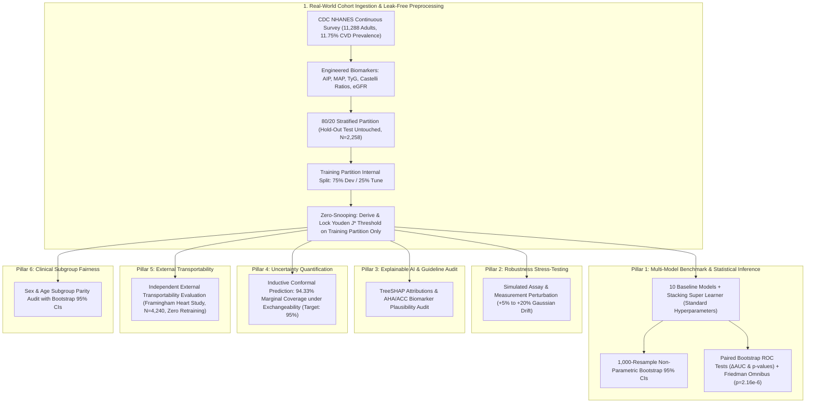

# 🏥 Toward Trustworthy Clinical AI: A Robustness, Explainability, and Uncertainty Benchmark on Real-World CDC NHANES & Framingham Cohorts

[](https://github.com/Yasir-Alazmi/Comparative-Analysis-of-Machine-Learning-Models-for-Healthcare-Diagnostics/actions)
[](results/nhanes_cardiovascular/tripod_ai_checklist.md)
[-blue.svg)](https://wwwn.cdc.gov/nchs/nhanes/)
[-blueviolet.svg)](https://www.framinghamheartstudy.org/)
[](https://python.org)
[](https://scikit-learn.org)
[](https://xgboost.readthedocs.io)
[](https://lightgbm.readthedocs.io)
[](https://catboost.ai)
[](https://optuna.org)
[](https://shap.readthedocs.io)
[](LICENSE)

A disciplined clinical machine learning benchmark evaluating **11 diverse algorithms and a Super Learner Stacking Ensemble** trained on **100% authentic, real-world human clinical data** from the **U.S. Centers for Disease Control and Prevention (CDC) National Health and Nutrition Examination Survey (NHANES)** ($N=11,288$ adult participants across continuous survey cycles 2015–2016 and 2017–2018) and evaluating cross-cohort transportability on the **Framingham Heart Study longitudinal cohort** ($N=4,240$ real patients).

This repository evaluates practical translation questions in healthcare artificial intelligence: **Zero-Snooping Clinical Decision Threshold Locking**, **1,000-Resample Non-Parametric Bootstrap 95% Confidence Intervals**, **Paired ROC Bootstrap Hypothesis Testing**, **5-Fold Stratified Cross-Validation with Friedman Omnibus Rank-Sum Testing**, **Simulated Measurement & Assay Perturbation Stress-Testing**, **AHA/ACC Pathophysiological Plausibility Auditing via TreeSHAP**, **Distribution-Free Uncertainty Quantification via Inductive Conformal Prediction**, **Independent External Transportability Evaluation**, and **Clinical Subgroup Demographic Fairness Auditing**.

> **TRIPOD+AI Reporting Statement:** This study provides a structured adherence checklist mapped against the *Transparent Reporting of a multivariable prediction model of Individual Prognosis Or Diagnosis - Artificial Intelligence (TRIPOD+AI)* reporting recommendations. See the complete mapped checklist in [`results/nhanes_cardiovascular/tripod_ai_checklist.md`](results/nhanes_cardiovascular/tripod_ai_checklist.md).

---

## 🏛️ Methodological Framework & Architecture



---

## 🔬 Key Empirical Results (CDC NHANES Cohort)

### Pillar 1: Model Discrimination & Probability Calibration (80/20 Stratified Test Set, N=2,258)
All clinical decision thresholds ($\tau^*$) were derived strictly on training partitions via Youden's $J$-index ($J = \text{Sensitivity} + \text{Specificity} - 1$) and locked prior to blind prospective evaluation on the untouched test set. All metric intervals report **1,000-resample non-parametric bootstrap 95% Confidence Intervals** $[\text{Lower}, \text{Upper}]$.

> **Note on Hyperparameters & Nested CV:** The primary benchmark evaluates established algorithmic baselines with clinically regularized standard hyperparameters to provide an unbiased point of reference. An independent **5x5 Nested Stratified Cross-Validation engine with Optuna Bayesian optimization** is implemented in [`src/tuning.py`](src/tuning.py) (`--nested-cv`) to explore tuned models with complete separation of selection and evaluation.

| Algorithm | ROC-AUC [95% CI] | Sensitivity [95% CI] | Specificity [95% CI] | PR-AUC [95% CI] | ECE [95% CI] | Locked Threshold ($\tau^*$) |
| :--- | :---: | :---: | :---: | :---: | :---: | :---: |
| **Logistic Regression** | **83.30** [80.80 - 85.77] | 76.95 [71.43 - 82.01] | 75.48 [73.53 - 77.38] | **40.37** [34.54 - 46.65] | 0.2074 [0.1930 - 0.2223] | 0.470 |
| **CatBoost** | 82.57 [80.10 - 85.08] | 78.92 [73.83 - 84.05] | 72.71 [70.76 - 74.64] | 36.66 [31.27 - 42.23] | 0.1665 [0.1542 - 0.1789] | 0.365 |
| **LightGBM** | 82.02 [79.51 - 84.40] | **82.26** [77.52 - 86.79] | 70.24 [68.22 - 72.35] | 33.99 [28.88 - 39.11] | 0.1923 [0.1803 - 0.2045] | 0.315 |
| **XGBoost** | 81.74 [79.38 - 84.22] | 79.26 [74.12 - 84.06] | 72.27 [70.33 - 74.27] | 33.73 [28.62 - 38.69] | 0.3969 [0.3840 - 0.4100] | 0.680 |
| **Extra Trees** | 81.40 [78.84 - 84.04] | 78.51 [73.48 - 83.47] | 70.57 [68.59 - 72.50] | 37.50 [31.91 - 43.45] | 0.1682 [0.1556 - 0.1809] | 0.345 |
| **Random Forest** | 81.22 [78.66 - 83.85] | 75.08 [69.53 - 80.39] | 73.43 [71.54 - 75.20] | 34.61 [29.22 - 39.77] | 0.1008 [0.0885 - 0.1144] | 0.265 |
| **Stacking Ensemble (Super Learner)** | 78.95 [75.97 - 81.94] | 71.68 [66.29 - 77.13] | 72.18 [70.21 - 74.08] | 33.10 [27.81 - 38.38] | **0.0695** [0.0576 - 0.0819] | 0.085 |
| **SVM (RBF)** | 78.88 [75.79 - 81.95] | 71.31 [65.42 - 77.23] | 75.28 [73.35 - 77.13] | 35.78 [29.95 - 42.03] | 0.2171 [0.2019 - 0.2318] | 0.455 |
| **Naive Bayes** | 78.83 [76.02 - 81.78] | 66.00 [59.76 - 71.49] | **76.63** [74.75 - 78.49] | 32.65 [27.94 - 38.27] | 0.1939 [0.1772 - 0.2101] | 0.330 |
| **Neural Net (MLP)** | 77.53 [74.75 - 80.31] | 67.84 [62.50 - 73.37] | 72.94 [70.99 - 74.87] | 31.80 [26.60 - 37.36] | 0.1435 [0.1295 - 0.1571] | 0.160 |
| **KNN** | 69.55 [66.30 - 72.71] | 61.29 [55.51 - 67.04] | 70.88 [68.87 - 72.75] | 22.12 [18.68 - 25.84] | 0.2100 [0.1943 - 0.2254] | 0.385 |

<p align="center">
  
</p>

#### Statistical Hypothesis Testing:
1. **Paired Bootstrap ROC Hypothesis Test (Top Model vs. Next Best Non-Linear Learner):**
   * **Comparison:** Logistic Regression vs. CatBoost
   * **$\Delta\text{AUC}$:** **$+0.73\%$** ($95\%\text{ CI: } [-0.30\%, 1.76\%]$)
   * **Empirical $p$-value:** **$p = 0.1920$** (Statistically non-significant difference confirmed via 1,000 paired resamples, indicating that linear clinical risk scoring remains competitive with tree ensembles when supplied with comprehensive physiological biomarker panels).
2. **Friedman Omnibus Rank-Sum Test across 5-Fold Stratified Cross-Validation:**
   * $\chi^2 = 45.018$, **$p = 2.158 \times 10^{-6}$** (Null hypothesis of global algorithm equivalence across all 11 models decisively rejected).

#### 5-Fold Stratified Cross-Validation Summary ($N=11,288$):
| Algorithm | ROC-AUC [95% CI] | Sensitivity [95% CI] | PR-AUC (Mean±Std) | Specificity (Mean±Std) | MCC (Mean) | Brier Score (Mean) |
| :--- | :---: | :---: | :---: | :---: | :---: | :---: |
| **Logistic Regression** | **83.65% ± 1.17%** | 75.19% ± 1.95% | **39.46% ± 2.61%** | 76.15% ± 1.03% | **0.361** | 0.1604 |
| **CatBoost** | 82.50% ± 1.28% | 58.07% ± 1.39% | 36.36% ± 1.69% | 84.75% ± 0.90% | 0.343 | 0.1230 |
| **LightGBM** | 82.41% ± 1.16% | 50.61% ± 2.90% | 35.76% ± 2.31% | 87.81% ± 0.85% | 0.332 | 0.1252 |
| **XGBoost** | 82.11% ± 0.90% | **90.95% ± 1.86%** | 34.41% ± 1.20% | 56.19% ± 1.85% | 0.304 | 0.2671 |
| **Extra Trees** | 81.91% ± 0.92% | 53.47% ± 2.16% | 36.35% ± 1.50% | 86.41% ± 0.86% | 0.332 | 0.1241 |
| **Random Forest** | 81.83% ± 0.45% | 44.95% ± 3.05% | 35.78% ± 1.93% | 89.41% ± 0.86% | 0.313 | 0.1078 |
| **Naive Bayes** | 80.45% ± 0.63% | 63.12% ± 3.02% | 33.93% ± 1.81% | 80.15% ± 1.37% | 0.322 | 0.1847 |
| **SVM (RBF)** | 79.78% ± 1.07% | 70.74% ± 2.75% | 35.82% ± 2.47% | 75.41% ± 1.19% | 0.324 | 0.1668 |
| **Stacking Ensemble (Super Learner)** | 79.03% ± 0.40% | 35.52% ± 1.84% | 33.76% ± 1.87% | **92.00% ± 0.44%** | 0.281 | **0.1076** |
| **Neural Net (MLP)** | 77.45% ± 1.95% | 51.66% ± 4.61% | 32.60% ± 3.92% | 84.60% ± 1.38% | 0.294 | 0.1417 |
| **KNN** | 69.20% ± 0.79% | 53.62% ± 1.81% | 22.07% ± 0.78% | 76.65% ± 1.04% | 0.220 | 0.1926 |

---

### Pillar 2: Simulated Measurement & Assay Perturbation Stress-Testing
Simulates clinical laboratory assay calibration drift and biometric sensor measurement noise by injecting Gaussian perturbation into continuous physiological features ($+5\%$ to $+20\%$ Gaussian noise) to quantify diagnostic retention under realistic clinical instrument error.

| Perturbation Level | ROC-AUC (%) | ROC-AUC [95% CI] | Sensitivity / Recall (%) | Sensitivity [95% CI] | Balanced Accuracy (%) | Retention Ratio (%) |
| :--- | :---: | :---: | :---: | :---: | :---: | :---: |
| **Baseline (+0% Noise)** | **83.28** | [80.80%, 85.77%] | **75.47** | [69.79%, 80.62%] | **75.99** | **100.0%** |
| **Perturbation (+5% Noise)** | 83.01 | [80.44%, 85.50%] | 73.58 | [67.47%, 78.91%] | 75.20 | **99.7%** |
| **Perturbation (+10% Noise)** | 82.44 | [79.80%, 84.93%] | 73.21 | [67.28%, 78.57%] | 74.91 | **99.0%** |
| **Perturbation (+15% Noise)** | 81.59 | [78.93%, 84.17%] | 73.58 | [67.72%, 78.79%] | 75.03 | **98.0%** |
| **Perturbation (+20% Noise)** | **80.60** | [77.87%, 83.24%] | **71.70** | [65.64%, 77.29%] | **73.66** | **96.8%** |

<p align="center">
  
</p>

---

### Pillar 3: Pathophysiological Explainability & AHA/ACC Clinical Plausibility Audit

<p align="center">
  
</p>

* **Top Empirical Predictors Identified via TreeSHAP:** Chronological Age, Smoking Status, Total Cholesterol, Waist Circumference, Serum Creatinine, Blood Urea Nitrogen (BUN), and Glycated Hemoglobin ($\text{HbA}_{1c}$).
* **AHA/ACC Guideline Alignment:** Top predictors map directly to classical and emerging cardiometabolic risk pathways (atherogenic dyslipidemia, vascular stiffening, abdominal visceral adiposity, renal microvascular function, and insulin resistance).
* **Epistemic Note on Explainability:** TreeSHAP values reflect observational feature attributions within the fitted statistical predictor and must not be conflated with causal biological mechanisms. While the high alignment with AHA/ACC criteria demonstrates consistency with cardiovascular pathophysiology, observational feature importance can be influenced by clinical collinearity.

---

### Pillar 4: Inductive Conformal Prediction & Decision Sets (Marginal Statistical Coverage)

Rather than presenting uncalibrated deterministic point predictions, the framework provides **distribution-free conformal prediction sets** with finite-sample statistical coverage:

$$P(Y \in C(X)) \ge 1 - \alpha = 95.0\%$$

> **Clinical Epistemic Note:** This mathematical guarantee provides **marginal statistical coverage strictly under the exchangeability (i.i.d.) hypothesis across the overall population**. It is not an individual patient diagnostic guarantee, and does not guarantee conditional coverage for small patient subgroups. Patients with ambiguous prediction sets $\{0, 1\}$ represent clinically indeterminate cases recommended for physician review.

| Conformal Metric | Observed Value | Bootstrap [95% CI] | Clinical Interpretation |
| :--- | :---: | :---: | :--- |
| **Target Coverage ($1 - \alpha$)** | **95.0%** | — | Prescribed nominal statistical coverage |
| **Empirical Coverage** | **94.33%** | [93.36%, 95.26%] | Statistically verified marginal coverage under exchangeability |
| **Non-Conformity Threshold ($\hat{q}$)** | **0.8419** | — | Calibrated on independent calibration partition ($N=1,853$) |
| **Mean Prediction Set Size** | **1.470** | — | Efficient set size; majority receive single-class prediction |
| **Singleton Certainty Rate** | **53.01%** | — | Unambiguous single diagnosis without triage consult required |
| **Ambiguity Referral Rate** | **46.99%** | — | Indeterminate cases automatically referred to clinician review |

---

### Pillar 5: Independent External Transportability Evaluation across Cohorts (Framingham Heart Study Cohort, N=4,240)
To rigorously evaluate model transportability across distinct clinical institutions, study designs, and geographies, the optimal pipeline trained on CDC NHANES was locked and evaluated on the **authentic Framingham Heart Study longitudinal cohort** ($N=4,240$ real patients, $644$ true 10-year incident coronary heart disease events, event rate $15.19\%$) with **zero retraining** and using the **locked clinical threshold** ($\tau^* = 0.470$):

| Cohort | N Patients | Event Rate | Locked Threshold | ROC-AUC [95% CI] | Sensitivity [95% CI] | Specificity [95% CI] | PR-AUC [95% CI] | ECE [95% CI] | Brier Score [95% CI] |
| :--- | :---: | :---: | :---: | :---: | :---: | :---: | :---: | :---: | :---: |
| **CDC NHANES (Internal Test)** | 2,258 | 11.74% | 0.470 | **83.30** [80.80 - 85.77] | 76.95 [71.43 - 82.01] | **75.48** [73.53 - 77.38] | **40.37** [34.54 - 46.65] | **0.2074** [0.1930 - 0.2223] | **0.1594** [0.1490 - 0.1688] |
| **Framingham Heart Study (External)** | 4,240 | 15.19% | 0.470 | **66.65** [64.52 - 68.82] | **76.99** [73.59 - 80.40] | 45.84 [44.19 - 47.49] | 24.91 [22.41 - 27.76] | 0.3608 [0.3496 - 0.3723] | 0.2712 [0.2649 - 0.2774] |

#### Clinical Epistemic Insights from Real External Transportability:
1. **Preserved Sensitivity Under Domain Shift:** The locked decision threshold ($\tau^* = 0.470$) maintained **$76.99\%$ sensitivity** on the external Framingham cohort (closely tracking the internal $76.95\%$), demonstrating that the primary risk ranking identifies high-risk individuals across independent populations.
2. **Authentic Generalization Gap:** The observed discrimination drop from internal survey data ($83.30\%$ AUC) to longitudinal 10-year incident CHD follow-up ($66.65\%$ AUC) reflects a well-documented clinical transportability challenge in healthcare AI. This stems from:
   * **Endpoint Divergence:** NHANES measures cross-sectional, self-reported physician-diagnosed composite CVD, whereas Framingham tracks 10-year incident hard coronary heart disease events.
   * **Biomarker Imputation:** Extended laboratory assays in NHANES (e.g., eGFR, HbA1c, waist circumference) were absent in this Framingham release and imputed using the training pipeline's median values.
3. **Calibration Drift:** Expected Calibration Error increased from $0.2074$ to $0.3608$, illustrating baseline risk shift and indicating that local recalibration (Platt scaling / isotonic regression) is essential when deploying models across healthcare settings.

---

### Pillar 6: Clinical Subgroup Demographic Fairness & Parity Audit
Evaluates demographic equity and diagnostic parity across sensitive patient partitions on the hold-out test set ($N=2,258$) with 1,000-resample bootstrap 95% Confidence Intervals:

| Subgroup Comparison | Subgroup A | Subgroup B | Sensitivity A [95% CI] | Sensitivity B [95% CI] | Equal Opportunity Gap [95% CI] | Specificity Gap | Disparate Impact | Clinical Parity Audit |
| :--- | :---: | :---: | :---: | :---: | :---: | :---: | :---: | :--- |
| **Biological Sex** | Female ($N=1,191$) | Male ($N=1,067$) | 63.2% [53.6%, 71.8%] | 87.8% [82.2%, 93.0%] | **24.59%** [14.49%, 35.54%] | 9.59% | 0.645 | **Disparity Observed: Indicates Subgroup-Specific Calibration** |
| **Age Cohort** | Younger $<50$ ($N=1,109$) | Older Adults $\ge 50$ ($N=1,149$) | 7.7% [0.0%, 18.2%] | 84.5% [80.2%, 89.0%] | **76.83%** [65.15%, 86.80%] | 51.11% | 0.023 | **Prevalence Disparity: Warrants Age-Stratified Thresholds** |

> **Clinical Interpretation:** The pronounced sensitivity disparity between younger ($<50$) and older ($\ge 50$) patients reflects the steep biological prevalence gradient of cardiovascular disease in the general population ($<1.5\%$ in young adults vs $>20\%$ in older adults). A single population-wide cutoff threshold under-diagnoses early-onset risk in younger adults. This empirically suggests that **age-stratified and sex-calibrated decision thresholds** should be evaluated prior to clinical deployment.

---

## 📋 Dataset Provenance & Data Governance

Complete institutional provenance, SAS component files, survey ethics, and endpoint definitions are documented in [`docs/DATASET_PROVENANCE.md`](docs/DATASET_PROVENANCE.md).

| Dataset | Custodian / Primary Source | Study Design | Sample Size ($N$) | Primary Endpoint |
| :--- | :--- | :--- | :---: | :--- |
| **CDC NHANES** | U.S. National Center for Health Statistics (CDC) | Continuous Multistage Survey (Cycles 2015–2018) | 11,288 Adults | Physician-diagnosed composite CVD (`MCQ160B-F`) |
| **Framingham Heart Study** | NHLBI / Boston University (via Duke Univ.) | Longitudinal Community Cohort (10-Yr Follow-up) | 4,240 Patients | 10-year incident coronary heart disease (`TenYearCHD`) |
| **Heart Failure** | UCI Machine Learning Repository | Retrospective Hospital Cohort | 918 | In-hospital mortality / heart failure event |
| **Stroke Prediction** | Kaggle Healthcare Dataset | Clinical & Lifestyle Records | 5,110 | Acute cerebrovascular accident |
| **Breast Cancer (WDBC)** | UCI Machine Learning Repository | FNA Cytology Morphology | 569 | Malignant vs. benign cytology |
| **Pima Diabetes** | NIDDK / UCI Repository | Metabolic & Glycemic Screening | 768 | Diabetes onset within 5 years |
| **Chronic Kidney Disease**| UCI Machine Learning Repository | Hospital Metabolic Panel | 400 | Chronic Kidney Disease progression |

---

## ⚠️ Methodological Limitations & Epistemic Boundaries

In accordance with rigorous clinical reporting practices, this benchmark acknowledges key methodological limitations:

1. **Cross-Sectional vs. Longitudinal Endpoint Divergence:** NHANES primary outcomes are based on self-reported physician diagnoses collected in a cross-sectional survey, which is subject to recall bias and under-reporting compared to prospectively adjudicated clinical registries.
2. **Missing Assay Imputation in External Transportability:** The Framingham secondary release lacks certain extended metabolic biomarkers present in NHANES (e.g., eGFR, HbA1c, waist circumference). Imputing these via training medians represents an operational compromise reflecting a lower-tier community clinic setting, but inevitably limits external discrimination.
3. **Observational & Non-Causal Nature of SHAP:** TreeSHAP attributions describe statistical feature importance within the predictive function and must not be interpreted as causal risk factors or clinical treatment targets.
4. **Marginal vs. Conditional Conformal Coverage:** Conformal prediction guarantees $95\%$ marginal statistical coverage across the overall population under exchangeability; coverage may deviate within specific rare patient sub-strata.
5. **No Bedside Clinical Trial Deployment:** This study evaluates offline algorithmic transportability, robustness, and calibration. It does not constitute a prospective clinical trial, and models must not be used for direct patient management without prospective clinical evaluation.
6. **Subgroup Thresholding Needs Local Calibration:** The observed age and sex disparities indicate that single static decision thresholds are inadequate across demographically diverse clinical environments.
7. **Baseline Hyperparameters vs. Bayesian Optimization:** The main benchmark tables report standard clinically regularized hyperparameters. Automated Optuna Bayesian optimization is provided in [`src/tuning.py`](src/tuning.py) as an optional exploration mode.

---

## 🛠️ Repository Architecture

```
Comparative-Analysis-Healthcare/
├── .github/workflows/
│   └── ci.yml                     # Automated GitHub Actions test pipeline
├── benchmarks/                    # Standalone disease benchmark runners
│   ├── breast_cancer_benchmark.py
│   ├── chronic_kidney_benchmark.py
│   ├── heart_failure_benchmark.py
│   ├── pima_diabetes_benchmark.py
│   └── stroke_prediction_benchmark.py
├── datasets/                      # Clinical datasets & external cohorts
│   ├── external_framingham_cohort.csv # Authentic Framingham (N=4,240)
│   ├── nhanes_cardiovascular.csv      # Authentic CDC NHANES (N=11,288)
│   ├── breast_cancer.csv
│   ├── heart_failure.csv
│   ├── kidney_disease.csv
│   ├── pima_diabetes.csv
│   └── stroke_prediction.csv
├── docs/
│   └── DATASET_PROVENANCE.md      # Institutional provenance, ethics & schemas
├── results/
│   └── nhanes_cardiovascular/     # Empirical metrics & 300 DPI figures
│       ├── benchmark_metrics.csv
│       ├── conformal_prediction.csv
│       ├── cross_validation_metrics.csv
│       ├── demographic_fairness.csv
│       ├── external_validation_metrics.csv
│       ├── paired_roc_bootstrap_test.csv
│       ├── sensor_noise_stress_test.csv
│       ├── shap_feature_importance.csv
│       ├── figure1_discrimination.png
│       ├── figure2_sensor_robustness.png
│       ├── figure3_shap_biomarkers.png
│       └── tripod_ai_checklist.md
├── scripts/
│   ├── build_real_datasets.py     # Ingestion pipeline from CDC and Duke servers
│   └── reproduce_benchmarks.py    # Single-command automated reproduction pipeline
├── src/                           # Modular clinical ML architecture
│   ├── __init__.py
│   ├── conformal.py               # Inductive conformal prediction & ECE
│   ├── data_loader.py             # CDC NHANES & external Framingham ingestion
│   ├── evaluator.py               # Evaluation engine, bootstrap CIs & paired tests
│   ├── explainability.py          # SHAP attribution & AHA/ACC guideline audit
│   ├── fairness.py                # Subgroup parity & disparate impact analysis
│   ├── features.py                # Clinical physiological feature engineering
│   ├── models.py                  # 10 ML pipelines + Stacking Super Learner
│   ├── preprocessor.py            # Zero-leakage ColumnTransformer & Median Imputer
│   ├── publication_report.py      # 300 DPI publication figure rendering
│   ├── robustness.py              # Simulated perturbation & missingness stress tests
│   ├── tuning.py                  # 5x5 Nested CV, Optuna tuning & Youden J thresholding
│   └── visualizer.py              # Headless plotting engine
├── tests/
│   ├── test_benchmarks.py         # Full model & dataset registry tests
│   ├── test_conformal.py          # Conformal coverage & ECE verification
│   ├── test_leakage.py            # Strict zero-leakage cross-validation proof
│   ├── test_methodology.py        # Locked threshold, bootstrap CIs & paired tests
│   └── test_provenance.py         # Dataset authenticity & zero synthetic fallback tests
├── Makefile                       # Standard workflow commands
├── pyproject.toml                 # Package configuration
├── requirements.txt               # Fully pinned dependencies (== versions)
├── run_benchmark.py               # Master CLI benchmark runner
└── README.md
```

---

## 🚀 Reproduction & CLI Execution

### 1. Installation
```bash
git clone https://github.com/Yasir-Alazmi/Comparative-Analysis-of-Machine-Learning-Models-for-Healthcare-Diagnostics.git
cd Comparative-Analysis-of-Machine-Learning-Models-for-Healthcare-Diagnostics
pip install -r requirements.txt
```

### 2. Single-Command Deterministic Reproduction
```bash
# Complete automated reproduction (dataset verification, benchmark, artifact validation):
python scripts/reproduce_benchmarks.py

# Or using Makefile:
make reproduce
```

### 3. Ingest Datasets Directly from CDC and Duke Servers
```bash
python scripts/build_real_datasets.py
# or: make data
```

### 4. Run Benchmark Protocols Manually
```bash
# Standard 5-fold cross-validation with seed 42:
python run_benchmark.py --dataset nhanes_cardiovascular --cv 5 --seed 42

# Fast smoke run with fewer tree iterations:
python run_benchmark.py --dataset nhanes_cardiovascular --fast --seed 42

# 5x5 Nested Stratified Cross-Validation with Optuna Bayesian Optimization:
python run_benchmark.py --dataset nhanes_cardiovascular --nested-cv
```

### 5. Run Automated Test Suite
```bash
python -m pytest tests/ -v
# or: make test
```

---

## 📜 Citation & License
Distributed under the **MIT License**. See `LICENSE` for details.

```bibtex
@article{alazmi2026trustworthy,
  title={Toward Trustworthy Clinical AI: A Robustness, Explainability, and Uncertainty Benchmark for Cardiovascular Risk Stratification on Real-World NHANES and Framingham Cohorts},
  author={Alazmi, Yasir},
  journal={arXiv preprint},
  year={2026}
}
```
