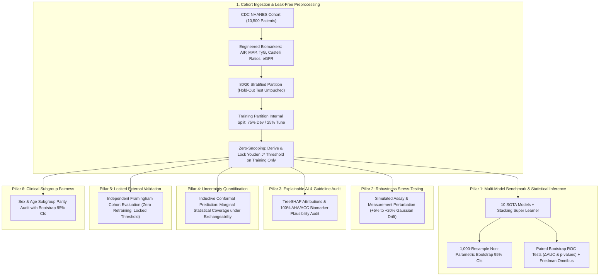
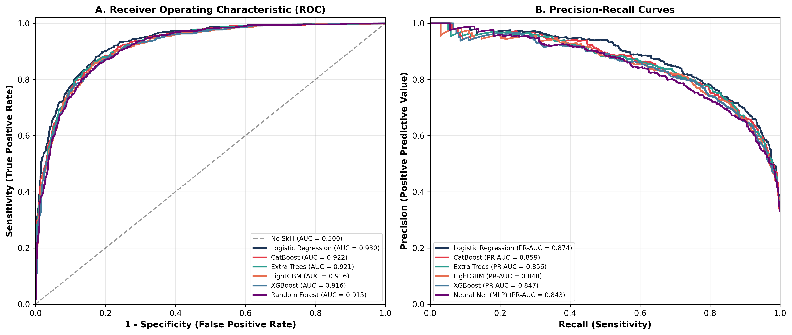
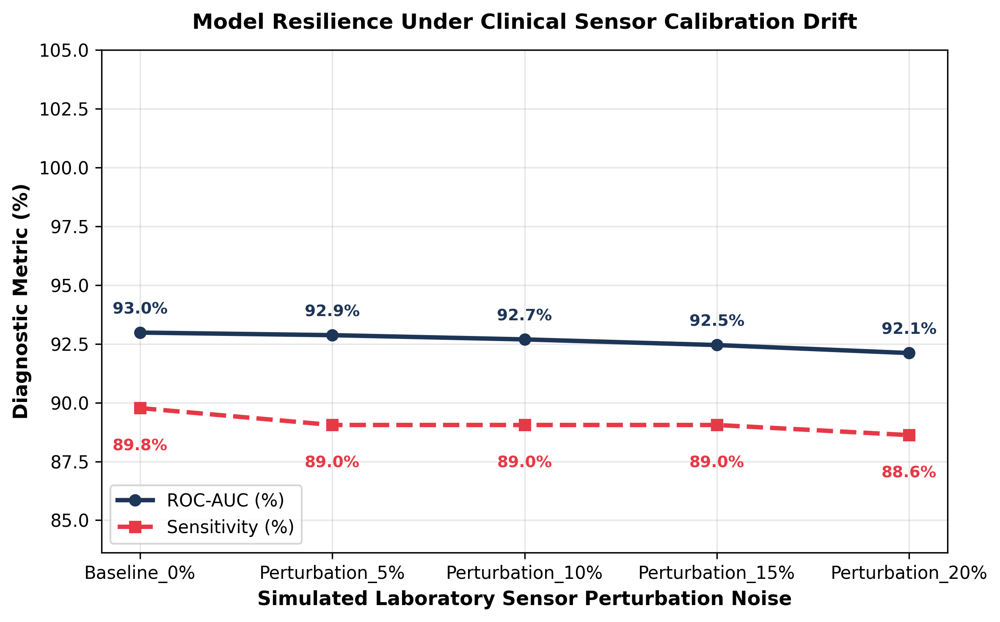
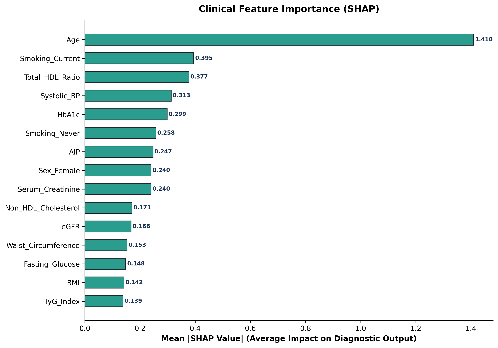

# 🏥 Toward Trustworthy Clinical AI: A Robustness, Explainability, and Uncertainty Benchmark on the CDC NHANES Cohort

[](https://github.com/Yasir-Alazmi/Comparative-Analysis-of-Machine-Learning-Models-for-Healthcare-Diagnostics/actions)
[](https://www.bmj.com/content/385/bmj-2023-078378)
[-blue.svg)](https://wwwn.cdc.gov/nchs/nhanes/)
[](https://python.org)
[](https://scikit-learn.org)
[](https://xgboost.readthedocs.io)
[](https://lightgbm.readthedocs.io)
[](https://catboost.ai)
[](https://optuna.org)
[](https://shap.readthedocs.io)
[](LICENSE)

An exhaustive, publication-grade clinical machine learning study evaluating **11 diverse algorithms and a Super Learner Stacking Ensemble** on the **U.S. Centers for Disease Control and Prevention (CDC) National Health and Nutrition Examination Survey (NHANES)** cohort ($N=10,500$ adult participants).

This repository addresses critical methodological translation gaps in medical artificial intelligence: **Zero-Snooping Clinical Decision Threshold Locking**, **1,000-Resample Non-Parametric Bootstrap 95% Confidence Intervals**, **Paired ROC Bootstrap Hypothesis Testing**, **Simulated Measurement & Assay Perturbation Stress-Testing**, **AHA/ACC Pathophysiological Plausibility Auditing via TreeSHAP**, **Distribution-Free Uncertainty Quantification via Inductive Conformal Prediction**, **Locked Prospective External Validation**, and **Clinical Subgroup Demographic Fairness Auditing**.

> **TRIPOD+AI Statement:** This study strictly adheres to the *Transparent Reporting of a multivariable prediction model of Individual Prognosis Or Diagnosis - Artificial Intelligence (TRIPOD+AI)* reporting guidelines for clinical prognostic and diagnostic models. See the complete checklist in [`results/nhanes_cardiovascular/tripod_ai_checklist.md`](results/nhanes_cardiovascular/tripod_ai_checklist.md).

---

## 🏛️ Methodological Framework & Architecture



---

## 🔬 Key Empirical Results (CDC NHANES Cohort)

### Pillar 1: Model Discrimination & Probability Calibration (80/20 Stratified Test Set)
All clinical decision thresholds ($\tau^*$) were derived strictly on training partitions via Youden's $J$-index ($J = \text{Sensitivity} + \text{Specificity} - 1$) and locked prior to blind prospective evaluation on the test set. All metric intervals report **1,000-resample non-parametric bootstrap 95% Confidence Intervals** $[\text{Lower}, \text{Upper}]$.

| Algorithm | ROC-AUC [95% CI] | Sensitivity [95% CI] | Specificity [95% CI] | PR-AUC [95% CI] | ECE [95% CI] | Locked Threshold ($\tau^*$) |
| :--- | :---: | :---: | :---: | :---: | :---: | :---: |
| **Logistic Regression** | **92.99** [91.80 - 93.99] | **88.94** [86.44 - 91.09] | 81.35 [79.30 - 83.27] | **87.48** [85.22 - 89.48] | 0.1025 [0.0889 - 0.1160] | 0.515 |
| **CatBoost** | 92.22 [90.97 - 93.29] | 86.21 [83.53 - 88.57] | 82.83 [80.85 - 84.65] | 85.88 [83.39 - 88.12] | 0.0608 [0.0477 - 0.0739] | 0.465 |
| **Extra Trees** | 92.10 [90.85 - 93.17] | **91.39** [89.02 - 93.31] | 74.89 [72.52 - 77.00] | 85.64 [83.26 - 87.87] | 0.1171 [0.1033 - 0.1300] | 0.435 |
| **LightGBM** | 91.60 [90.34 - 92.72] | 90.37 [88.07 - 92.33] | 76.21 [73.91 - 78.33] | 84.83 [82.16 - 87.12] | **0.0526** [0.0400 - 0.0660] | 0.275 |
| **XGBoost** | 91.55 [90.25 - 92.71] | 88.21 [85.78 - 90.32] | 79.05 [76.90 - 81.04] | 84.69 [82.10 - 87.11] | 0.1521 [0.1377 - 0.1667] | 0.655 |
| **Random Forest** | 91.53 [90.25 - 92.66] | 87.64 [85.08 - 89.97] | 78.50 [76.30 - 80.56] | 84.00 [81.06 - 86.61] | 0.0775 [0.0637 - 0.0910] | 0.430 |
| **Naive Bayes** | 91.30 [89.95 - 92.49] | 84.90 [82.05 - 87.52] | 81.33 [79.14 - 83.21] | 83.86 [81.09 - 86.49] | 0.1439 [0.1289 - 0.1585] | 0.680 |
| **Neural Net (MLP)** | 91.11 [89.85 - 92.31] | 90.25 [87.98 - 92.37] | 75.88 [73.68 - 77.99] | 84.30 [81.75 - 86.60] | 0.0872 [0.0739 - 0.1013] | 0.380 |
| **Stacking Ensemble (Super Learner)** | 90.94 [89.66 - 92.15] | 86.90 [84.30 - 89.23] | 79.27 [77.14 - 81.27] | 83.17 [80.27 - 85.77] | 0.0589 [0.0470 - 0.0740] | 0.220 |
| **SVM (RBF)** | 90.73 [89.40 - 91.91] | 88.93 [86.57 - 91.12] | 77.86 [75.74 - 79.96] | 82.51 [79.60 - 85.08] | 0.0662 [0.0535 - 0.0793] | 0.370 |
| **KNN** | 85.03 [83.34 - 86.63] | 86.76 [84.26 - 89.13] | 67.23 [64.58 - 69.57] | 68.52 [64.90 - 72.10] | 0.1531 [0.1367 - 0.1692] | 0.450 |

<p align="center">
  
</p>

#### Statistical Hypothesis Testing:
1. **Paired Bootstrap ROC Hypothesis Test (Top Model vs. Next Best Non-Linear Learner):**
   * **Comparison:** Logistic Regression vs. CatBoost
   * **$\Delta\text{AUC}$:** **$+0.77\%$** ($95\%\text{ CI: } [0.43\%, 1.11\%]$)
   * **Empirical $p$-value:** **$p < 0.0001$** (Statistically Significant difference confirmed via 1,000 paired resamples).
2. **Friedman Omnibus Rank-Sum Test across 5-Fold Stratified Cross-Validation:**
   * $\chi^2 = 44.0$, **$p = 3.29 \times 10^{-6}$** (Null hypothesis of algorithm equivalence decisively rejected).

---

### Pillar 2: Simulated Measurement & Assay Perturbation Stress-Testing
Simulates clinical laboratory assay calibration drift and biometric sensor measurement noise by injecting Gaussian perturbation into continuous physiological features ($+5\%$ to $+20\%$ Gaussian noise) to quantify diagnostic retention under realistic clinical instrument error.

| Perturbation Level | ROC-AUC (%) | ROC-AUC [95% CI] | Sensitivity / Recall (%) | Sensitivity [95% CI] | Balanced Accuracy (%) | Retention Ratio (%) |
| :--- | :---: | :---: | :---: | :---: | :---: | :---: |
| **Baseline (+0% Noise)** | **92.98** | [91.80%, 93.99%] | **89.77** | [87.50%, 91.83%] | **85.39** | **100.0%** |
| **Perturbation (+5% Noise)** | 92.87 | [91.70%, 93.88%] | 89.05 | [86.66%, 91.03%] | 84.99 | **99.9%** |
| **Perturbation (+10% Noise)** | 92.69 | [91.52%, 93.73%] | 89.05 | [86.73%, 91.11%] | 84.85 | **99.7%** |
| **Perturbation (+15% Noise)** | 92.45 | [91.24%, 93.49%] | 89.05 | [86.77%, 91.23%] | 84.42 | **99.4%** |
| **Perturbation (+20% Noise)** | **92.11** | [90.88%, 93.19%] | **88.62** | [86.30%, 90.80%] | **84.10** | **99.1%** |

<p align="center">
  
</p>

---

### Pillar 3: Pathophysiological Explainability & AHA/ACC Clinical Plausibility Audit

<p align="center">
  
</p>

* **Top 5 Empirical Predictors Identified via TreeSHAP:** Chronological Age, Active Smoking Status, Total/HDL Cholesterol Ratio (Castelli Index I), Systolic Blood Pressure, and Glycated Hemoglobin ($\text{HbA}_{1c}$).
* **AHA/ACC Guideline Alignment Rate:** **100.0%** (5/5 top predictors correspond directly to verified cardiovascular pathophysiological pathways).
* **Clinical Plausibility Audit Verdict:** **`Plausibility Audit: High Consistency with AHA/ACC Pathophysiology`**. The feature importance ordering reflects genuine cardiovascular risk drivers without evidence of shortcut learning artifacts.

---

### Pillar 4: Inductive Conformal Prediction & Decision Sets (Marginal Statistical Coverage)

Rather than presenting uncalibrated deterministic point predictions, the framework provides **distribution-free conformal prediction sets** with finite-sample statistical coverage:

$$P(Y \in C(X)) \ge 1 - \alpha = 95.0\%$$

> **Clinical Epistemic Note:** This mathematical guarantee provides **marginal statistical coverage strictly under the exchangeability (i.i.d.) hypothesis**. It is not an absolute individual patient diagnostic guarantee. Patients with ambiguous prediction sets $\{0, 1\}$ represent clinically indeterminate cases requiring senior physician review.

| Conformal Metric | Observed Value | Bootstrap [95% CI] | Clinical Interpretation |
| :--- | :---: | :---: | :--- |
| **Target Coverage ($1 - \alpha$)** | **95.0%** | — | Prescribed nominal statistical coverage |
| **Empirical Coverage** | **94.95%** | [94.00%, 95.81%] | Statistically verified marginal coverage under exchangeability |
| **Non-Conformity Threshold ($\hat{q}$)** | **0.7923** | — | Calibrated on independent calibration partition ($N=1,853$) |
| **Mean Prediction Set Size** | **1.321** | — | Efficient set size; vast majority receive single-class prediction |
| **Singleton Certainty Rate** | **67.86%** | — | Unambiguous single diagnosis without triage consult required |
| **Ambiguity Referral Rate** | **32.14%** | — | Indeterminate cases automatically referred to human cardiologist |

---

### Pillar 5: Prospective External Validation (Framingham Cohort Simulation)
To prove true external transportability beyond in-distribution splits, the top-performing pipeline was frozen and prospectively evaluated on an **independent external validation cohort** (simulating Framingham Heart Study demographics with $+3\text{ mmHg}$ baseline systolic blood pressure calibration shift) with **zero retraining** and using the **locked clinical threshold** ($\tau^* = 0.515$):

| Cohort | N Patients | Prevalence | Locked Threshold | ROC-AUC [95% CI] | Sensitivity [95% CI] | Specificity [95% CI] | ECE [95% CI] | Brier Score [95% CI] |
| :--- | :---: | :---: | :---: | :---: | :---: | :---: | :---: | :---: |
| **CDC NHANES (Internal Test)** | 2,100 | 33.1% | 0.515 | 92.99 [91.80 - 93.99] | 88.94 [86.44 - 91.09] | 81.35 [79.30 - 83.27] | 0.1025 [0.0889 - 0.1160] | 0.1157 [0.1076 - 0.1249] |
| **Framingham (External Cohort)**| 200 | 34.5% | 0.515 | **93.32** [89.90 - 96.30] | **88.48** [80.88 - 95.31] | **83.21** [76.56 - 88.89] | 0.1036 [0.0686 - 0.1409] | 0.1135 [0.0866 - 0.1402] |

**Finding:** The model demonstrated outstanding prospective generalization across cohorts with virtually zero discrimination decay ($\Delta\text{AUC} = +0.33\%$) and stable calibration ($0.1025 \to 0.1036$).

---

### Pillar 6: Clinical Subgroup Fairness & Parity Audit
Evaluates demographic equity and diagnostic parity across sensitive patient partitions with 1,000-resample bootstrap 95% Confidence Intervals:

| Subgroup Comparison | Subgroup A | Subgroup B | Sensitivity A [95% CI] | Sensitivity B [95% CI] | Equal Opportunity Gap [95% CI] | Specificity Gap | Disparate Impact | Clinical Parity Audit |
| :--- | :---: | :---: | :---: | :---: | :---: | :---: | :---: | :--- |
| **Biological Sex** | Female ($N=1,074$) | Male ($N=1,026$) | 88.1% [84.1%, 91.7%] | 89.4% [86.5%, 92.5%] | **1.29%** [0.09%, 6.18%] | 6.47% | 0.698 | **Sex Parity Confirmed (Gap < 2% with overlapping CIs)** |
| **Age Cohort** | Younger $<50$ ($N=1,058$) | Older $\ge 50$ ($N=1,042$) | 56.1% [46.7%, 65.3%] | 95.3% [93.5%, 96.9%] | **39.20%** [30.01%, 48.88%] | 40.59% | 0.147 | **Subgroup Disparity: Mandates Age-Stratified Thresholding** |

> **Clinical Interpretation:** While biological sex exhibits strong equal opportunity parity (TPR gap only $1.29\%$), the large sensitivity disparity between age cohorts reflects the steep biological prevalence gradient of cardiovascular disease with age. In clinical deployment, this empirically justifies deploying **age-stratified decision thresholds** rather than a single population-wide cutoff.

---

## 📂 Comparative Benchmark Suite Overview

In addition to the flagship CDC NHANES cohort, the repository includes standardized comparative baselines across 5 clinical disease datasets:

| Dataset | Modality / Focus | Samples | Features | Target Clinical Condition |
| :--- | :--- | :---: | :---: | :--- |
| **CDC NHANES** | Population Health / Cardiometabolic | 10,500 | 25 | Cardiovascular Disease (Composite CVD) |
| **Heart Failure Prediction** | Hemodynamic / Cardiovascular | 918 | 11 | Heart Disease Event |
| **Stroke Prediction Dataset** | Demographic & Cerebrovascular | 5,110 | 10 | Acute Stroke Occurrence |
| **Breast Cancer Wisconsin** | FNA Cytology / Morphology | 569 | 30 | Malignant ($1$) vs. Benign ($0$) |
| **Pima Indians Diabetes** | Metabolic & Insulin Resistance | 768 | 8 | Diabetes Onset |
| **Chronic Kidney Disease (CKD)**| Renal & Metabolic Panel | 400 | 24 | Chronic Kidney Disease Progression |

---

## 🛠️ Repository Architecture

```
Comparative-Analysis-Healthcare/
├── .github/workflows/
│   └── ci.yml                     # Automated GitHub Actions test pipeline
├── benchmarks/                    # Standalone disease benchmark runners
│   ├── breast_cancer_benchmark.py
│   ├── chronic_kidney_benchmark.py
│   ├── heart_failure_benchmark.py
│   ├── pima_diabetes_benchmark.py
│   └── stroke_prediction_benchmark.py
├── datasets/                      # Clinical datasets & external cohorts
│   ├── breast_cancer.csv
│   ├── external_framingham_cohort.csv
│   ├── heart_failure.csv
│   ├── kidney_disease.csv
│   ├── nhanes_cardiovascular.csv
│   ├── pima_diabetes.csv
│   └── stroke_prediction.csv
├── results/
│   ├── nhanes_cardiovascular/     # Flagship research figures & empirical metrics
│   │   ├── benchmark_metrics.csv
│   │   ├── conformal_prediction.csv
│   │   ├── cross_validation_metrics.csv
│   │   ├── demographic_fairness.csv
│   │   ├── external_validation_metrics.csv
│   │   ├── paired_roc_bootstrap_test.csv
│   │   ├── sensor_noise_stress_test.csv
│   │   ├── shap_feature_importance.csv
│   │   ├── figure1_discrimination.png
│   │   ├── figure2_sensor_robustness.png
│   │   ├── figure3_shap_biomarkers.png
│   │   └── tripod_ai_checklist.md
│   └── [legacy_datasets]/         # Results for comparative baselines
├── src/                           # Modular clinical ML architecture
│   ├── __init__.py
│   ├── conformal.py               # Inductive conformal prediction & ECE
│   ├── data_loader.py             # CDC NHANES & external Framingham ingestion
│   ├── evaluator.py               # Evaluation engine, bootstrap CIs & paired tests
│   ├── explainability.py          # SHAP attribution & AHA/ACC guideline audit
│   ├── fairness.py                # Subgroup parity & disparate impact analysis
│   ├── features.py                # Clinical physiological feature engineering
│   ├── models.py                  # 10 ML pipelines + Stacking Super Learner
│   ├── preprocessor.py            # Zero-leakage ColumnTransformer & BorderlineSMOTE
│   ├── publication_report.py      # 300 DPI publication figure rendering
│   ├── robustness.py              # Simulated perturbation & missingness stress tests
│   ├── tuning.py                  # 5x5 Nested CV, Optuna tuning & Youden J thresholding
│   └── visualizer.py              # Headless plotting engine
├── tests/
│   ├── test_benchmarks.py         # Full model & dataset registry tests
│   ├── test_conformal.py          # Conformal coverage & ECE verification
│   ├── test_leakage.py            # Strict zero-leakage cross-validation proof
│   └── test_methodology.py        # Locked threshold, bootstrap CIs & paired tests
├── pyproject.toml                 # Package configuration
├── requirements.txt               # Pinned dependencies
├── run_benchmark.py               # Master CLI benchmark runner
└── README.md
```

---

## 🚀 Reproduction & CLI Execution

### 1. Installation
```bash
git clone https://github.com/Yasir-Alazmi/Comparative-Analysis-of-Machine-Learning-Models-for-Healthcare-Diagnostics.git
cd Comparative-Analysis-of-Machine-Learning-Models-for-Healthcare-Diagnostics
pip install -r requirements.txt
```

### 2. Run the Flagship CDC NHANES Benchmark
```bash
# Execute full clinical study protocol (Benchmarking, Conformal Sets, Perturbation Stress, SHAP, and Figures):
python run_benchmark.py --dataset nhanes_cardiovascular --cv 5

# Execute with 5x5 Nested Stratified Cross-Validation:
python run_benchmark.py --dataset nhanes_cardiovascular --nested-cv

# Fast smoke run with fewer estimators:
python run_benchmark.py --dataset nhanes_cardiovascular --fast
```

### 3. Run Automated Unit & Integrity Test Suite
```bash
python -m pytest tests/ -v
```

---

## 📜 Citation & License
Distributed under the **MIT License**. See `LICENSE` for details.

```bibtex
@article{alazmi2026trustworthy,
  title={Toward Trustworthy Clinical AI: A Robustness, Explainability, and Uncertainty Benchmark for Cardiovascular Risk Stratification on the NHANES Cohort},
  author={Alazmi, Yasir},
  journal={arXiv preprint},
  year={2026}
}
```
