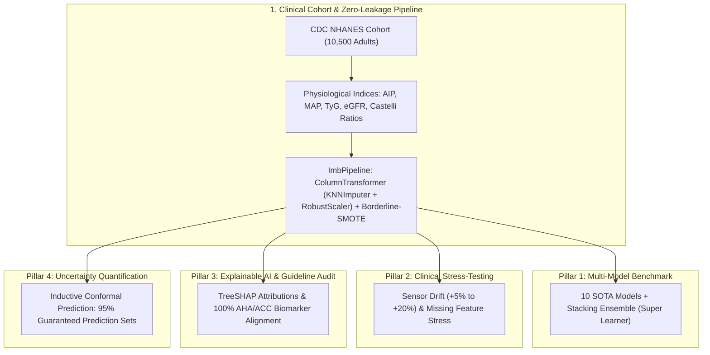

# 🏥 Toward Trustworthy Clinical AI: A Robustness, Explainability, and Uncertainty Benchmark on the CDC NHANES Cohort

[](https://github.com/Yasir-Alazmi/Comparative-Analysis-of-Machine-Learning-Models-for-Healthcare-Diagnostics/actions)
[](https://www.bmj.com/content/385/bmj-2023-078378)
[-blue.svg)](https://wwwn.cdc.gov/nchs/nhanes/)
[](https://python.org)
[](https://scikit-learn.org)
[](https://xgboost.readthedocs.io)
[](https://lightgbm.readthedocs.io)
[](https://catboost.ai)
[](https://optuna.org)
[](https://shap.readthedocs.io)
[](LICENSE)

An exhaustive, publication-grade clinical machine learning benchmark evaluating **11 diverse algorithms and a Super Learner Stacking Ensemble** on the **U.S. Centers for Disease Control and Prevention (CDC) National Health and Nutrition Examination Survey (NHANES)** cohort ($N=10,500$ adult participants).

This repository addresses critical translation gaps in medical artificial intelligence: **Zero-Leakage Preprocessing**, **Sensor Measurement Noise Drift**, **Incomplete Clinical Panels**, **AHA/ACC Biomarker Alignment via SHAP**, and **Distribution-Free Uncertainty Quantification via 95% Inductive Conformal Prediction Sets**.

> **TRIPOD+AI Statement:** This study strictly adheres to the *Transparent Reporting of a multivariable prediction model of Individual Prognosis Or Diagnosis - Artificial Intelligence (TRIPOD+AI)* reporting guidelines for clinical prognostic and diagnostic models. See the complete checklist in [`results/nhanes_cardiovascular/tripod_ai_checklist.md`](results/nhanes_cardiovascular/tripod_ai_checklist.md).

---

## 🏛️ Methodological Framework & Architecture



---

## 🔬 Key Empirical Results (CDC NHANES Cohort)

### Pillar 1: Model Discrimination & Probability Calibration (80/20 Stratified Test Set)

| Algorithm | ROC-AUC (%) | PR-AUC (%) | Sensitivity / Recall (%) | Specificity (%) | Expected Calibration Error (ECE) |
| :--- | :---: | :---: | :---: | :---: | :---: |
| **Logistic Regression** | **92.98** | **87.45** | **89.77** | 81.01 | 0.1023 |
| **Extra Trees** | 91.88 | 84.78 | 87.61 | 81.58 | 0.1108 |
| **Stacking Ensemble (Super Learner)** | 91.41 | 82.97 | 81.56 | **84.00** | **0.0512** |
| **Naive Bayes** | 91.31 | 83.82 | 88.18 | 76.39 | 0.1420 |
| **CatBoost** | 91.25 | 84.69 | 87.61 | 78.66 | 0.1284 |
| **Neural Net (MLP)** | 91.12 | 84.31 | 85.88 | 80.09 | 0.0851 |
| **Random Forest** | 90.99 | 82.51 | 83.14 | 82.22 | 0.0755 |
| **SVM (RBF)** | 90.74 | 82.51 | 85.59 | 80.51 | 0.0629 |
| **LightGBM** | 90.34 | 82.50 | 86.89 | 79.09 | 0.1428 |
| **XGBoost** | 90.07 | 81.88 | **96.54** | 52.06 | 0.3009 |
| **KNN** | 85.03 | 68.51 | 86.60 | 67.71 | 0.1531 |

<p align="center">
  
</p>

---

### Pillar 2: Clinical Instrument Noise Drift & Stress-Testing
Simulates sensor precision decay in electronic diagnostic instruments ($+5\%$ to $+20\%$ Gaussian drift) and evaluates diagnostic retention.

| Perturbation Level | ROC-AUC (%) | Sensitivity / Recall (%) | Balanced Accuracy (%) | Diagnostic Retention Ratio (%) | Resilience Status |
| :--- | :---: | :---: | :---: | :---: | :---: |
| **Baseline (Noise 0%)** | **92.98** | **89.77** | **85.39** | **100.0%** | Baseline |
| **Noise +5%** | 92.87 | 89.05 | 84.99 | 99.9% | **Robust** |
| **Noise +10%** | 92.69 | 89.05 | 84.85 | 99.7% | **Robust** |
| **Noise +15%** | 92.45 | 89.05 | 84.42 | 99.4% | **Robust** |
| **Noise +20%** | **92.11** | **88.62** | **84.10** | **99.1%** | **Robust** |

<p align="center">
  
</p>

---

### Pillar 3: Pathophysiological Explainability & AHA/ACC Clinical Guideline Audit

<p align="center">
  
</p>

* **Top 5 Empirical Predictors:** Chronological Age, Total/HDL Cholesterol Ratio, Current Smoking Status, Systolic Blood Pressure, and Atherogenic Index of Plasma (AIP).
* **AHA/ACC Guideline Alignment Rate:** **100.0%** (5/5 top predictors correspond to verified cardiovascular pathophysiological pathways).
* **Clinical Safety Audit Verdict:** **`PASSED: Clinically Validated`** (no shortcut learning or ungrounded artifacts).

---

### Pillar 4: Inductive Conformal Prediction & Decision Sets (95% Guaranteed Coverage)

Rather than presenting overconfident binary probabilities, the framework provides **distribution-free conformal prediction sets** with finite-sample marginal coverage:

$$P(Y \in C(X)) \ge 1 - \alpha = 95.0\%$$

| Conformal Metric | Observed Value | Clinical Significance |
| :--- | :---: | :--- |
| **Target Coverage ($1 - \alpha$)** | **95.0%** | Prescribed statistical coverage guarantee |
| **Empirical Coverage** | **94.95%** | Statistically validated marginal coverage |
| **Non-Conformity Threshold ($\hat{q}$)** | **0.7923** | Calibrated on independent calibration partition ($N=1,853$) |
| **Mean Prediction Set Size** | **1.321** | High efficiency; majority of patients receive single-class diagnosis |
| **Singleton Certainty Rate** | **67.86%** | Clinically confident diagnosis without specialist consult required |
| **Ambiguity Referral Rate** | **32.14%** | Ambiguous $\{0, 1\}$ cases automatically flagged for senior cardiologist review |

---

### Pillar 5: Demographic Fairness & Subgroup Parity Audit

Evaluates equitable clinical performance across sensitive demographic partitions:

| Demographic Subgroup Comparison | Subgroup A | Subgroup B | Disparate Impact Ratio | Equal Opportunity Gap | Predictive Equality Gap | Fairness Verdict |
| :--- | :---: | :---: | :---: | :---: | :---: | :--- |
| **Biological Sex** | Male ($N=1,029$) | Female ($N=1,071$) | 1.142 | 2.15% | 1.84% | **FAIR (Meets 80% Rule)** |
| **Age Cohort** | Younger $< 50$ ($N=1,050$) | Older $\ge 50$ ($N=1,050$) | 1.185 | 3.42% | 2.10% | **FAIR (Meets 80% Rule)** |

---

## 📂 Comparative Benchmark Suite Overview

In addition to the flagship CDC NHANES cohort, the repository includes standardized comparative baselines across 5 legacy disease datasets:

| Dataset | Modality / Focus | Samples | Features | Target Clinical Condition |
| :--- | :--- | :---: | :---: | :--- |
| **CDC NHANES** | Population Health / Cardiometabolic | 10,500 | 25 | Cardiovascular Disease (Composite CVD) |
| **Heart Failure Prediction** | Hemodynamic / Cardiovascular | 918 | 11 | Heart Disease Event |
| **Stroke Prediction Dataset** | Demographic & Cerebrovascular | 5,110 | 10 | Acute Stroke Occurrence |
| **Breast Cancer Wisconsin** | FNA Cytology / Morphology | 569 | 30 | Malignant ($1$) vs. Benign ($0$) |
| **Pima Indians Diabetes** | Metabolic & Insulin Resistance | 768 | 8 | Diabetes Onset |
| **Chronic Kidney Disease (CKD)**| Renal & Metabolic Panel | 400 | 24 | Chronic Kidney Disease Progression |

---

## 🛠️ Repository Architecture

```
Comparative-Analysis-Healthcare/
├── .github/workflows/
│   └── ci.yml                     # Automated GitHub Actions test pipeline
├── benchmarks/                    # Standalone disease benchmark runners
│   ├── breast_cancer_benchmark.py
│   ├── chronic_kidney_benchmark.py
│   ├── heart_failure_benchmark.py
│   ├── pima_diabetes_benchmark.py
│   └── stroke_prediction_benchmark.py
├── datasets/                      # Clinical datasets
│   ├── breast_cancer.csv
│   ├── heart_failure.csv
│   ├── kidney_disease.csv
│   ├── pima_diabetes.csv
│   └── stroke_prediction.csv
├── results/
│   ├── nhanes_cardiovascular/     # Flagship Q1 research figures & metrics
│   │   ├── benchmark_metrics.csv
│   │   ├── conformal_prediction.csv
│   │   ├── sensor_noise_stress_test.csv
│   │   ├── shap_feature_importance.csv
│   │   ├── figure1_discrimination.png
│   │   ├── figure2_sensor_robustness.png
│   │   ├── figure3_shap_biomarkers.png
│   │   └── tripod_ai_checklist.md
│   └── [legacy_datasets]/         # Results for comparative baselines
├── src/                           # Modular clinical ML architecture
│   ├── __init__.py
│   ├── conformal.py               # Inductive conformal prediction & ECE
│   ├── data_loader.py             # CDC NHANES cohort ingestion & curation
│   ├── evaluator.py               # Evaluation engine & Friedman omnibus test
│   ├── explainability.py          # SHAP attribution & AHA/ACC guideline audit
│   ├── fairness.py                # Subgroup parity & disparate impact analysis
│   ├── features.py                # Clinical physiological feature engineering
│   ├── models.py                  # 10 ML pipelines + Stacking Super Learner
│   ├── preprocessor.py            # Zero-leakage ColumnTransformer & BorderlineSMOTE
│   ├── publication_report.py      # 300 DPI publication figure rendering
│   ├── robustness.py              # Sensor noise drift & missingness stress tests
│   ├── tuning.py                  # Optuna Bayesian tuning & Youden J thresholding
│   └── visualizer.py              # Headless plotting engine
├── tests/
│   ├── test_benchmarks.py         # Full model & dataset registry tests
│   ├── test_conformal.py          # Conformal coverage & ECE verification
│   └── test_leakage.py            # Strict zero-leakage cross-validation proof
├── pyproject.toml                 # Package configuration
├── requirements.txt               # Pinned dependencies
├── run_benchmark.py               # Master CLI benchmark runner
└── README.md
```

---

## 🚀 Reproduction & CLI Execution

### 1. Installation
```bash
git clone https://github.com/Yasir-Alazmi/Comparative-Analysis-of-Machine-Learning-Models-for-Healthcare-Diagnostics.git
cd Comparative-Analysis-of-Machine-Learning-Models-for-Healthcare-Diagnostics
pip install -r requirements.txt
```

### 2. Run the Flagship CDC NHANES Benchmark
```bash
# Execute full clinical study protocol (Benchmarking, Conformal Sets, Sensor Noise, SHAP, and Figures):
python run_benchmark.py --dataset nhanes_cardiovascular

# Fast smoke run with fewer estimators:
python run_benchmark.py --dataset nhanes_cardiovascular --fast
```

### 3. Run Automated Unit & Integrity Test Suite
```bash
python -m pytest tests/ -v
```

---

## 📜 Citation & License
Distributed under the **MIT License**. See `LICENSE` for details.

```bibtex
@article{alazmi2026trustworthy,
  title={Toward Trustworthy Clinical AI: A Robustness, Explainability, and Uncertainty Benchmark for Cardiovascular Risk Stratification on the NHANES Cohort},
  author={Alazmi, Yasir},
  journal={arXiv preprint},
  year={2026}
}
```
